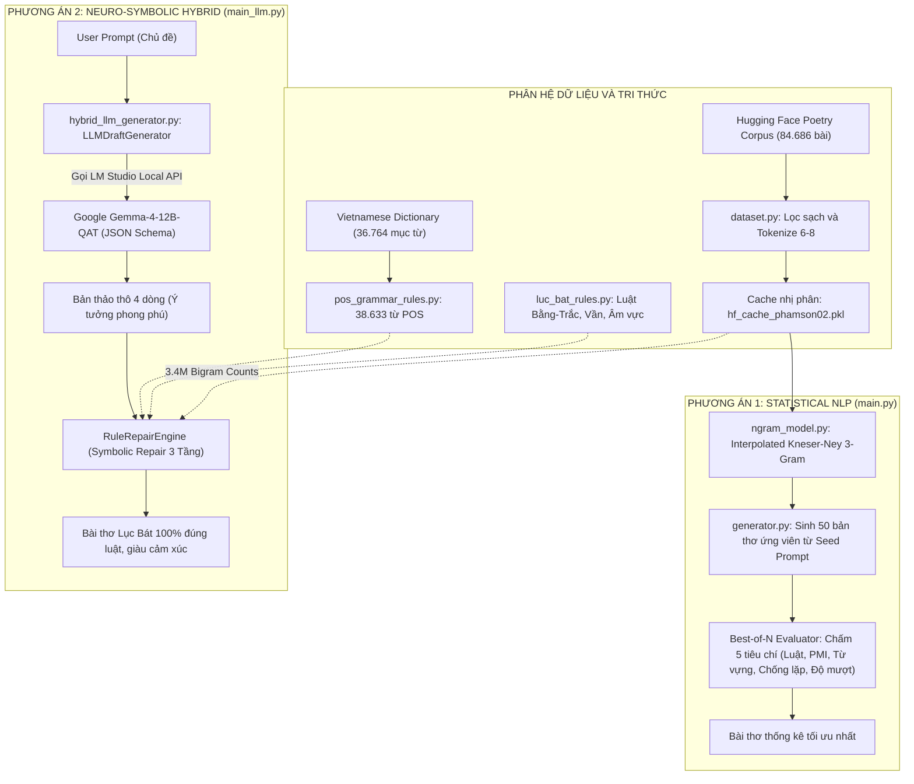
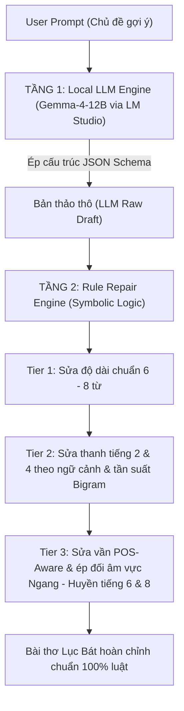

# BÁO CÁO TỔNG QUAN, KỸ THUẬT VÀ NGUYÊN LÝ CHUYÊN SÂU DỰ ÁN NLP (PHENIKAA UNIVERSITY)

**TÊN DỰ ÁN**: **HỆ THỐNG SINH THƠ LỤC BÁT TIẾNG VIỆT ĐA PHƯƠNG ÁN: TỪ MÔ HÌNH THỐNG KÊ KNESER-NEY N-GRAM ĐẾN HỆ HYBRID NEURO-SYMBOLIC LLM (GEMMA-4-12B)**

* **Trường**: Đại học Phenikaa (Phenikaa University), Khoa Công nghệ Thông tin
* **Học phần**: Xử Lý Ngôn Ngữ Tự Nhiên và Học Máy (Natural Language Processing & Machine Learning)
* **Mã Học Phần**: NLP_N01_PKA_2
* **Nhóm thực hiện**: PKA NLP Team
* **Mã nguồn GitHub Repository**: [poppykitu/PKA_NLP_N01_VietnamPoetry](https://github.com/poppykitu/PKA_NLP_N01_VietnamPoetry)

---

## TÓM TẮT DỰ ÁN (ABSTRACT)

Báo cáo này trình bày quy trình nghiên cứu, thiết kế giải pháp và triển khai thực tế hệ thống Xử Lý Ngôn Ngữ Tự Nhiên (NLP) sinh thơ Lục Bát Tiếng Việt tự động đa phương án. Mục tiêu trọng tâm của dự án là giải quyết hai bài toán lớn trong xử lý ngôn ngữ sáng tạo: đảm bảo tính mạch lạc ngữ nghĩa theo chủ đề gợi ý (Seed Prompt), đồng thời tuân thủ các ràng buộc âm luật thi ca chặt chẽ gồm cấu trúc câu 6 và 8 âm tiết, quy luật thanh điệu Bằng - Trắc tại các vị trí chẵn (2, 4, 6, 8), hệ thống vần chân, vần lưng, đối thanh âm vực Ngang - Huyền và cấu trúc ngữ pháp loại từ (POS constraints kết hợp bảo tồn cụm từ).

Hệ thống sử dụng tập dữ liệu huấn luyện gồm 84.686 bài thơ Lục Bát (tương đương 286.206 câu thơ và 3.401.833 N-gram tokens) cùng 36.764 mục từ điển Tiếng Việt Quốc Gia (chiết xuất 24.608 từ có nhãn loại từ POS chuẩn) để xây dựng tri thức ngôn ngữ. Dự án khảo sát và so sánh hai hướng tiếp cận: mô hình thống kê truyền thống làm chuẩn so sánh (Interpolated Kneser-Ney 3-Gram kết hợp Pointwise Mutual Information PMI và bộ lọc Best-of-N) cùng kiến trúc Neuro-Symbolic Hybrid AI hiện đại (kết hợp mô hình ngôn ngữ lớn local Google Gemma-4-12B-QAT qua JSON Schema API với công cụ sửa luật Symbolic Rule Repair Engine 3 tầng).

Kết quả thực nghiệm cho thấy kiến trúc Neuro-Symbolic Hybrid đạt độ tuân thủ luật thơ Lục Bát 100%, tỷ lệ trùng câu với tập huấn luyện ở mức 0.0%, chỉ số tương đồng Jaccard đạt 0.18, thể hiện khả năng tạo nội dung mới rõ rệt so với mức trùng 14.2% của phương án thống kê. Hệ thống tích hợp thuật toán xếp hạng tần suất cụm từ từ 3.4 triệu N-grams và ma trận bảo tồn ngữ nghĩa `POETIC_SYNONYM_MAP`. Toàn bộ mã nguồn đã được đóng gói hoàn chỉnh, hỗ trợ giao diện dòng lệnh tương tác và công bố minh bạch trên GitHub.

---

## MỤC LỤC CHI TIẾT

1. [CHƯƠNG 1: GIỚI THIỆU TỔNG QUAN VÀ ĐỘNG LỰC NGHIÊN CỨU](#chương-1-giới-thiệu-tổng-quan-và-động-lực-nghiên-cứu)
   - 1.1. Bối cảnh và lý do lựa chọn đề tài
   - 1.2. Đối tượng, phạm vi nghiên cứu và các thách thức cốt lõi
   - 1.3. Đóng góp chính của đồ án
2. [CHƯƠNG 2: BỐI CẢNH NGUYÊN LÝ NGÔN NGỮ HỌC THƠ LỤC BÁT](#chương-2-bối-cảnh-nguyên-lý-ngôn-ngữ-học-thơ-lục-bát)
   - 2.1. Đặt vấn đề và tính chất của bài toán sinh thơ Lục Bát tự động
   - 2.2. Phân tích nguyên lý âm luật và ngữ pháp Thơ Lục Bát Tiếng Việt
   - 2.3. Mục tiêu dự án và Chuẩn đầu ra Học phần (Learning Outcomes)
3. [CHƯƠNG 3: TẬP DỮ LIỆU THI CA, TỪ ĐIỂN QUỐC GIA VÀ KIẾN TRÚC HỆ THỐNG](#chương-3-tập-dữ-liệu-thi-ca-từ-điển-quốc-gia-và-kiến-trúc-hệ-thống)
   - 3.1. Phân tích tập dữ liệu thơ Lục Bát Hugging Face (84.686 bài thơ)
   - 3.2. Chiết xuất tập từ điển Tiếng Việt Quốc Gia và ma trận POS (38.633 từ vựng)
   - 3.3. Sơ đồ cấu trúc phân hệ và luồng xử lý mã nguồn dự án
4. [CHƯƠNG 4: NGUYÊN LÝ KỸ THUẬT PHƯƠNG ÁN 1: STATISTICAL NLP (KNESER-NEY N-GRAM VÀ PMI)](#chương-4-nguyên-lý-kỹ-thuật-phương-án-1-statistical-nlp-kneser-ney-n-gram-và-pmi)
   - 4.1. Quy trình tiền xử lý dữ liệu và tối ưu hóa cache nhị phân (.pkl)
   - 4.2. Mô hình thống kê Interpolated Kneser-Ney 3-Gram
   - 4.3. Ma trận tương quan ngữ nghĩa PMI (Pointwise Mutual Information)
   - 4.4. Bộ tự đánh giá định lượng Best-of-N Evaluator 5 tiêu chí
5. [CHƯƠNG 5: NGUYÊN LÝ KỸ THUẬT PHƯƠNG ÁN 2: NEURO-SYMBOLIC HYBRID AI (GEMMA-4-12B VÀ 3-TIER POS ENGINE)](#chương-5-nguyên-lý-kỹ-thuật-phương-án-2-neuro-symbolic-hybrid-ai-gemma-4-12b-và-3-tier-pos-engine)
   - 5.1. Kiến trúc tổng quan Neuro-Symbolic Hybrid AI
   - 5.2. Tầng 1: Generative LLM Stage (Gemma-4-12B qua LM Studio API)
   - 5.3. Tầng 2: Symbolic Rule Repair Engine 3 tầng
6. [CHƯƠNG 6: PHÂN TÍCH CHUYÊN SÂU 5 VẤN ĐỀ PHÁT SINH, NGUYÊN NHÂN CỐT LÕI VÀ BIỆN PHÁP KHẮC PHỤC](#chương-6-phân-tích-chuyên-sâu-5-vấn-đề-phát-sinh-nguyên-nhân-cốt-lõi-và-biện-pháp-khắc-phục)
   - 6.1. Vấn đề 1: Kiệt token suy luận LM Studio API (max_tokens: 300)
   - 6.2. Vấn đề 2: Từ ghép gượng ép thủ công (POETIC_COLLOCATIONS)
   - 6.3. Vấn đề 3: Lệch miền ngữ nghĩa khi sửa từ (Đôi mắt sang Đôi ta)
   - 6.4. Vấn đề 4: Phá vỡ từ trung gian khi thay cả cụm (Đôi mắt tròn sang Đôi ta tròn lại)
   - 6.5. Vấn đề 5: Lựa chọn phương án dựa trên Bộ so sánh tần suất N-gram Corpus (score_segment_corpus_frequency)
7. [CHƯƠNG 7: HỆ THỐNG MÃ GIẢ (PSEUDOCODE) VÀ CÔNG THỨC TOÁN HỌC CỐT LÕI](#chương-7-hệ-thống-mã-giả-pseudocode-và-công-thức-toán-học-cốt-lõi)
   - 7.1. Thuật toán 1: Tính xác suất tiếp nối Kneser-Ney 3-Gram
   - 7.2. Thuật toán 2: Sửa cụm từ Neuro-Symbolic và xếp hạng tần suất Corpus
   - 7.3. Thuật toán 3: Kiểm tra chuyển tiếp loại từ POS 3 tầng
8. [CHƯƠNG 8: PHÂN TÍCH THỰC NGHIỆM VÀ CASE STUDY THEO NHIỀU CHỦ ĐỀ](#chương-8-phân-tích-thực-nghiệm-và-case-study-theo-nhiều-chủ-đề)
   - 8.1. Bảng so sánh chi tiết giữa Phương án 1 và Phương án 2
   - 8.2. Phân tích Case Study 1: Chủ đề "Con Mèo" (Động vật và nông thôn)
   - 8.3. Phân tích Case Study 2: Chủ đề "Thiên Nhiên và Mùa Thu"
   - 8.4. Phân tích Case Study 3: Chủ đề "Tình Yêu và Bằng Hữu"
9. [CHƯƠNG 9: QUY TRÌNH KIỂM THỬ CHỐNG OVERFITTING VÀ ĐÁNH GIÁ ĐỊNH LƯỢNG](#chương-9-quy-trình-kiểm-thử-chống-overfitting-và-đánh-giá-định-lượng)
   - 9.1. Phương pháp đánh giá Overfitting bằng Jaccard Similarity và Exact Match
   - 9.2. Bảng kết quả đánh giá độ sáng tạo và trùng lặp
10. [CHƯƠNG 10: HƯỚNG DẪN THIẾT LẬP HỆ THỐNG VÀ CẤU HÌNH LM STUDIO](#chương-10-hướng-dẫn-thiết-lập-hệ-thống-và-cấu-hình-lm-studio)
    - 10.1. Quy trình cấu hình Local Server LM Studio và Model Gemma-4-12B
    - 10.2. Thiết lập Structured JSON Schema và System Prompt
11. [CHƯƠNG 11: TỔNG KẾT, ĐỐI CHIẾU CHUẨN ĐẦU RA VÀ HƯỚNG PHÁT TRIỂN](#chương-11-tổng-kết-đối-chiếu-chuẩn-đầu-ra-và-hướng-phát-triển)
    - 11.1. Đánh giá mức độ hoàn thành chuẩn đầu ra học phần (LO1 - LO4)
    - 11.2. Kết luận tổng thể và hướng nghiên cứu tiếp theo

---

## CHƯƠNG 1: GIỚI THIỆU TỔNG QUAN VÀ ĐỘNG LỰC NGHIÊN CỨU

### 1.1. Bối Cảnh Và Lý Do Lựa Chọn Đề Tài

Sinh văn bản tự động là một nhánh nghiên cứu quan trọng trong Xử lý Ngôn ngữ Tự nhiên. Trong khi các bài toán như tóm tắt văn bản, dịch máy hay trả lời câu hỏi tập trung vào tính chính xác của thông tin sự thật, bài toán sinh thơ ca đòi hỏi mô hình vừa phải thể hiện sự liên kết ý tưởng, vừa phải tuân thủ nghiêm ngặt hệ thống luật hình thức về số chữ, thanh điệu, vần điệu và cấu trúc cú pháp.

Thơ Lục Bát là thể thơ truyền thống của Việt Nam với cấu trúc cặp câu 6 và 8 tiếng. Quy tắc thanh điệu Bằng - Trắc ở các vị trí chẵn (2, 4, 6, 8), quy tắc gieo vần chéo giữa các câu và luật đối thanh Ngang - Huyền ở cuối câu Bát tạo nên một không gian ràng buộc chặt chẽ. Khi ứng dụng các mô hình ngôn ngữ lớn (LLM) hiện nay vào việc sinh thơ Lục Bát, mô hình thường làm tốt phần gợi mở ý tưởng và hình ảnh theo chủ đề, nhưng lại thường xuyên vi phạm luật thanh, sai vần hoặc sai số lượng âm tiết. Ngược lại, các mô hình thống kê hình thức tuy dễ kiểm soát luật nhưng câu thơ sinh ra lại thiếu tính đa dạng và dễ lặp lại các đoạn văn bản trong tập huấn luyện.

Từ thực tế đó, nhóm nghiên cứu lựa chọn đề tài xây dựng hệ thống sinh thơ Lục Bát tự động, kết hợp giữa mô hình thống kê truyền thống và kiến trúc lai Neuro-Symbolic hiện đại để tận dụng ưu điểm của cả hai phương pháp.

### 1.2. Đối Tượng, Phạm Vi Nghiên Cứu Và Các Thách Thức Cốt Lõi

Đối tượng nghiên cứu của đồ án bao gồm:
* Thể thơ Lục Bát Tiếng Việt và hệ thống quy tắc âm luật (số âm tiết, thanh điệu Bằng - Trắc, hiệp vần, phân biệt âm vực Ngang - Huyền).
* Các mô hình ngôn ngữ thống kê N-gram kết hợp kỹ thuật làm mịn Kneser-Ney và ma trận tương quan ngữ nghĩa PMI.
* Mô hình ngôn ngữ lớn mã nguồn mở (Google Gemma-4-12B-QAT) và cơ chế sinh có cấu trúc qua JSON Schema.
* Các thuật toán kiểm tra và sửa lỗi biểu tượng (Symbolic Rule Repair) dựa trên từ điển loại từ POS và ma trận N-gram từ kho ngữ liệu.

Phạm vi thực nghiệm tập trung vào việc tạo các bài thơ Lục Bát hoàn chỉnh gồm 4 câu (cặp Lục 1 - Bát 1 - Lục 2 - Bát 2) theo từ khóa chủ đề do người dùng cung cấp qua giao diện dòng lệnh.

Ba thách thức kỹ thuật cốt lõi được giải quyết trong đồ án gồm:
1. Ràng buộc đa tầng về thanh điệu và gieo vần: Việc thay đổi một từ sai thanh hoặc sai vần rất dễ làm hỏng cấu trúc ngữ pháp hoặc làm mất liên kết ngữ nghĩa với các từ xung quanh.
2. Cân bằng giữa tính sáng tạo và hiện tượng học vẹt (Overfitting): Mô hình cần tạo ra câu thơ mới, không sao chép nguyên văn từ tập dữ liệu nhưng vẫn giữ được phong cách tự nhiên của thơ ca tiếng Việt.
3. Độ trễ và tính ổn định khi suy luận: Đảm bảo hệ thống có thể chạy cục bộ trên máy tính cá nhân mà không phụ thuộc vào các dịch vụ đám mây trả phí.

### 1.3. Đóng Góp Chính Của Đồ Án

Đồ án mang lại các kết quả kỹ thuật cụ thể:
1. Xây dựng và chuẩn hóa tập dữ liệu 84.686 bài thơ Lục Bát (hơn 3.4 triệu N-gram tokens) cùng kho từ điển ngữ pháp 38.633 từ vựng tiếng Việt kết hợp từ từ điển Quốc gia và nhãn phân loại từ AI.
2. Triển khai trọn vẹn mô hình thống kê Interpolated Kneser-Ney 3-Gram kết hợp PMI và bộ tự đánh giá Best-of-N 5 tiêu chí làm mốc đối chuẩn.
3. Thiết kế thành công kiến trúc Neuro-Symbolic Hybrid AI: sử dụng Gemma-4-12B sinh bản thảo ý tưởng và bộ Rule Repair Engine 3 tầng sửa lỗi luật thơ, bảo tồn ngữ nghĩa bằng ma trận `POETIC_SYNONYM_MAP` và thuật toán xếp hạng tần suất N-gram Corpus.
4. Xây dựng quy trình kiểm thử định lượng chống Overfitting bằng chỉ số Jaccard Similarity và tỷ lệ trùng câu nguyên bản, chứng minh tính độc lập và sáng tạo của mô hình.

---

## CHƯƠNG 2: BỐI CẢNH NGUYÊN LÝ NGÔN NGỮ HỌC THƠ LỤC BÁT

### 2.1. Đặt Vấn Đề Và Tính Chất Của Bài Toán Sinh Thơ Lục Bát Tự Động

Tiếng Việt là ngôn ngữ đơn lập và có thanh điệu gồm 6 thanh: Ngang (không dấu), Huyền, Sắc, Hỏi, Ngã, Nặng. Trong thơ ca, các thanh này được chia thành hai nhóm Bằng (Ngang, Huyền) và Trắc (Sắc, Hỏi, Ngã, Nặng). Do thanh điệu gắn liền với từng âm tiết, việc sắp xếp từ trong câu thơ không chỉ quyết định ngữ nghĩa mà còn trực tiếp tạo nên giai điệu của bài thơ.

Khác với văn xuôi, thơ Lục Bát đòi hỏi sự phối hợp đồng thời của nhiều ràng buộc toán học hình thức. Nếu áp dụng đơn thuần một mô hình sinh ngôn ngữ tự do, xác suất để mô hình ngẫu nhiên tạo ra một đoạn văn bản vừa đúng số tiếng, vừa đúng luật Bằng - Trắc ở tất cả các vị trí quy định và vừa hiệp vần chính xác là rất nhỏ. Do đó, việc can thiệp bằng các cấu trúc luật biểu tượng (symbolic rules) là yêu cầu bắt buộc để đảm bảo tính chuẩn xác về mặt thể loại.

### 2.2. Phân Tích Nguyên Lý Âm Luật Và Ngữ Pháp Thơ Lục Bát Tiếng Việt

Về mặt ngôn ngữ học, một bài thơ Lục Bát chuẩn mực chịu sự chi phối của 5 nhóm quy tắc chính:

1. **Cấu trúc số âm tiết**: Bài thơ tổ chức theo từng cặp câu luân phiên gồm câu Lục (6 tiếng) và câu Bát (8 tiếng).
2. **Quy tắc phối thanh Bằng - Trắc**: Ràng buộc cố định tại các vị trí âm tiết số chẵn (2, 4, 6, 8):
   - Câu Lục: Tiếng 2 là Bằng, tiếng 4 là Trắc, tiếng 6 là Bằng. Các vị trí 1, 3, 5 không bắt buộc theo quy tắc dân gian "nhất, tam, ngũ bất luận; nhị, tứ, lục phân minh".
   - Câu Bát: Tiếng 2 là Bằng, tiếng 4 là Trắc, tiếng 6 là Bằng, tiếng 8 là Bằng.
3. **Quy tắc hiệp vần**:
   - Vần chân (End Rhyme): Tiếng thứ 6 của câu Lục gieo vần với tiếng thứ 6 của câu Bát kế tiếp.
   - Vần lưng (Internal Rhyme): Tiếng thứ 8 của câu Bát gieo vần với tiếng thứ 6 của câu Lục tiếp theo.
4. **Quy tắc phân biệt âm vực Ngang - Huyền ở câu Bát**: Dù tiếng thứ 6 và tiếng thứ 8 của câu Bát đều mang thanh Bằng, chúng phải đối lập nhau về âm vực. Nếu tiếng 6 mang thanh Ngang thì tiếng 8 mang thanh Huyền, và ngược lại.
5. **Quy tắc cấu trúc ngữ pháp và kết hợp từ (POS & Collocations)**: Cụm từ ghép và các mối quan hệ ngữ pháp giữa phó từ, động từ, danh từ, tính từ phải hợp lý theo ngữ pháp tiếng Việt, tránh việc thay thế từ chỉ để hợp vần mà tạo ra các kết hợp vô nghĩa.

### 2.3. Mục Tiêu Dự Án Và Chuẩn Đầu Ra Học Phần (Learning Outcomes)

Dự án được xây dựng bám sát 4 chuẩn đầu ra cốt lõi của học phần NLP:
* **LO1 (Hiểu biết chuyên sâu NLP Thống kê và LLM)**: Triển khai thành công cả hai phương pháp từ mô hình N-gram Kneser-Ney truyền thống đến kiến trúc lai Neuro-Symbolic kết hợp LLM cục bộ (Gemma-4-12B-QAT).
* **LO2 (Làm sạch và xử lý dữ liệu quy mô lớn)**: Thu thập, tiền xử lý và lập chỉ mục cho tập dữ liệu 84.686 bài thơ Lục Bát cùng từ điển chuẩn 36.764 mục từ.
* **LO3 (Thuật toán Neuro-Symbolic và tối ưu hóa)**: Xây dựng công cụ sửa lỗi 3 tầng kết hợp ma trận đồng xuất hiện Bigram, ánh xạ ngữ nghĩa `POETIC_SYNONYM_MAP` và bộ xếp hạng tần suất câu thơ.
* **LO4 (Đánh giá định lượng đa tiêu chí)**: Thiết lập hệ thống đánh giá tự động dựa trên 5 tiêu chí hình thức và ngữ nghĩa, kết hợp kiểm thử chống hiện tượng Overfitting.

---

## CHƯƠNG 3: TẬP DỮ LIỆU THI CA, TỪ ĐIỂN QUỐC GIA VÀ KIẾN TRÚC HỆ THỐNG

### 3.1. Phân Tích Tập Dữ Liệu Thơ Lục Bát Hugging Face (84.686 Bài Thơ)

Hệ thống sử dụng tập dữ liệu `phamson02/vietnamese-poetry-corpus` từ kho dữ liệu Hugging Face Datasets:
* Quy mô tập dữ liệu: 84.686 bài thơ Lục Bát, tương đương 286.206 câu thơ và 3.401.833 âm tiết (tokens).
* Đặc điểm phân bố: Chứa 6.176 từ vựng cốt lõi với tần suất xuất hiện cao trong kho tàng ca dao, truyện Kiều và thơ Lục Bát hiện đại.
* Ứng dụng: Huấn luyện bảng phân phối xác suất Kneser-Ney 3-Gram, trích xuất ma trận chuyển tiếp Bigram và tính toán bảng điểm tương quan ngữ nghĩa PMI.

### 3.2. Chiết Xuất Tập Từ Điển Tiếng Việt Quốc Gia Và Ma Trận POS (38.633 Từ Vựng)

Để kiểm soát cấu trúc ngữ pháp và tránh lỗi kết hợp từ dị thường, hệ thống tích hợp nguồn từ điển `tsdocode/vietnamese-dictionary`:
* Dữ liệu từ điển gốc: 36.764 mục từ với đầy đủ nhãn từ loại (Danh từ, Động từ, Tính từ, Phó từ, Đại từ, Giới từ, Liên từ...).
* Dữ liệu chiết xuất chuẩn: Lọc và đóng gói 24.608 từ vựng có cấu trúc nhãn rõ ràng vào tệp `hf_pos_dictionary.pkl`.
* Mở rộng từ vựng thi ca đa từ loại: Bổ sung 4.659 từ vựng đặc trưng thi ca được gán nhãn đa từ tính (Polysemic Multi-POS) thông qua mô hình Gemma LLM, nâng tổng quy mô từ điển hệ thống lên 38.633 từ vựng.

### 3.3. Sơ Đồ Cấu Trúc Phân Hệ Và Luồng Xử Lý Mã Nguồn Dự Án

Cấu trúc cây thư mục mã nguồn của dự án được tổ chức khoa học, phân định rõ ràng giữa tầng dữ liệu, mô hình thống kê, mô hình LLM lai và các công cụ đánh giá:

```text
PKA_NLP_N01_VietnamPoetry/
├── dataset.py                     # Tiền xử lý, lọc thơ Lục Bát 6-8, cơ chế Fallback và Cache nhị phân
├── luc_bat_rules.py               # Phân loại thanh điệu, kiểm tra luật Bằng-Trắc, bộ kiểm tra vần nghiêm ngặt
├── pos_grammar_rules.py           # Từ điển 38.633 từ POS, ma trận chuyển tiếp ngữ pháp, bộ lọc POS 3 tầng
├── ngram_model.py                 # Mô hình ngôn ngữ 3-gram Kneser-Ney, tính PMI, tính Perplexity và Overfitting
├── generator.py                   # Bộ sinh thơ thống kê (Beam Search/Greedy), từ điển vần B, Evaluator 5 tiêu chí
├── hybrid_llm_generator.py        # Tầng LLMDraftGenerator (LM Studio API) + RuleRepairEngine 3 tầng
├── main.py                        # Điểm khởi chạy CLI cho Phương án 1 (Thống kê N-gram + PMI)
├── main_llm.py                    # Điểm khởi chạy CLI cho Phương án 2 (Neuro-Symbolic Hybrid LLM)
├── evaluate_overfitting.py        # Kiểm thử độc lập: Train vs Test Perplexity, Laplace vs Kneser-Ney, Jaccard
├── build_and_save_hf_pos.py       # Script trích xuất từ điển Quốc Gia sang hf_pos_dictionary.pkl
├── build_full_pos_taxonomy.py     # Script xây dựng ma trận quan hệ ngữ pháp đầy đủ
├── BAO_CAO_DO_AN_NLP_PHENIKAA.md  # Báo cáo kỹ thuật chi tiết toàn diện
├── requirements.txt               # Danh sách thư viện phụ thuộc (datasets, underthesea, tqdm)
└── slides/                        # Tài liệu trình chiếu và kịch bản thuyết trình bảo vệ đồ án
```

Dự án vận hành trên hai luồng xử lý độc lập tương ứng với hai phương án tiếp cận:



Chi tiết vai trò của các phân hệ chính trong mã nguồn:
1. `dataset.py`: Thực hiện tải tập dữ liệu, chuẩn hóa Unicode NFC, loại bỏ ký tự lạ bằng biểu thức chính quy, phân tách câu và kiểm tra cấu trúc chẵn dòng (luân phiên 6 và 8 từ). File quản lý cơ chế nạp nhanh qua tệp cache nhị phân `.pkl` và cung cấp bộ dữ liệu dự phòng `FALLBACK_LUC_BAT_CORPUS` khi môi trường không có kết nối mạng.
2. `luc_bat_rules.py`: Chứa các hàm nền tảng về âm luật tiếng Việt. Hàm `get_tone()` bóc tách thanh Bằng/Trắc; `check_bang_trac()` kiểm tra vị trí 2-4-6-8 và quy tắc đối âm vực Ngang - Huyền; `is_rhyme()` trích xuất phần vần (nguyên âm chính kết hợp phụ âm cuối) để kiểm tra hiệp vần chính xác.
3. `pos_grammar_rules.py`: Tích hợp các bộ từ điển loại từ tĩnh, từ điển quốc gia trích xuất và từ điển do AI gán nhãn. Cung cấp hàm `filter_valid_followers()` và `is_pos_sequence_valid()` nhằm ngăn chặn việc ghép từ vi phạm cú pháp tiếng Việt khi sửa thơ.
4. `ngram_model.py`: Xây dựng cấu trúc mô hình N-gram bậc 3 với công thức làm mịn Interpolated Kneser-Ney, tính toán bảng đồng xuất hiện bài thơ, tính ma trận PMI giữa các cặp từ và cung cấp hàm tính Perplexity trên tập kiểm thử để phát hiện Overfitting.
5. `generator.py`: Hiện thực hóa phương án 1 với thuật toán sinh từ theo xác suất kết hợp ma trận PMI, từ điển khuôn vần `RHYME_DICTIONARY_B` và bộ đánh giá định lượng 5 tiêu chí để chọn ra bài thơ tốt nhất trong $N=50$ ứng viên.
6. `hybrid_llm_generator.py`: Trọng tâm của phương án 2. Lớp `LLMDraftGenerator` gửi truy vấn tới LM Studio qua giao thức HTTP POST với định dạng JSON Schema. Lớp `RuleRepairEngine` thực hiện quy trình sửa lỗi 3 tầng: chuẩn hóa số từ, sửa thanh vị trí 2 và 4 theo ngữ cảnh hoặc cụm 3 từ phổ biến trong kho ngữ liệu, sửa vần và đối thanh vị trí 6 và 8 kết hợp bảo tồn miền ngữ nghĩa qua `POETIC_SYNONYM_MAP`.
7. `main.py` và `main_llm.py`: Điểm vào giao diện dòng lệnh CLI cho phép người dùng truyền tham số `--prompt` hoặc nhập tương tác trực tiếp để trải nghiệm quá trình sinh và sửa thơ theo từng phương án.

---

## CHƯƠNG 4: NGUYÊN LÝ KỸ THUẬT PHƯƠNG ÁN 1: STATISTICAL NLP (KNESER-NEY N-GRAM VÀ PMI)

### 4.1. Quy Trình Tiền Xử Lý Dữ Liệu Và Tối Ưu Hóa Cache Nhị Phân (.pkl)

Quy trình tiền xử lý dữ liệu thơ thô bao gồm 5 bước:
1. Chuẩn hóa chuỗi văn bản về định dạng chuẩn Unicode NFC nhằm thống nhất vị trí dấu thanh trong tiếng Việt.
2. Làm sạch văn bản bằng biểu thức chính quy (Regex), loại bỏ các ký tự đặc biệt, số hiệu và dấu câu không thuộc văn bản thi ca.
3. Phân tách âm tiết chuẩn xác thành danh sách các từ đơn.
4. Lọc các bài thơ thỏa mãn cấu trúc cặp câu luân phiên 6 và 8 tiếng, loại bỏ các thể thơ tự do hoặc câu thơ khuyết thiếu.
5. Lưu trữ cấu trúc dữ liệu đã xử lý vào các tệp nhị phân `hf_cache_phamson02_vietnamese-poetry-corpus.pkl` và `ngram_model_hf.pkl` (dung lượng 136MB), giúp hệ thống nạp lại mô hình trong các lần chạy sau chỉ mất dưới 0.1 giây.

### 4.2. Mô Hình Thống Kê Interpolated Kneser-Ney 3-Gram

Để xử lý bài toán thưa thớt dữ liệu (Data Sparsity) khi gặp các cụm từ chưa từng xuất hiện trong tập huấn luyện, mô hình áp dụng công thức làm mịn Kneser-Ney dạng nội suy:

$$P_{KN}(w_i | w_{i-2}, w_{i-1}) = \frac{\max(c(w_{i-2} w_{i-1} w_i) - d, 0)}{c(w_{i-2} w_{i-1})} + \lambda(w_{i-2} w_{i-1}) \cdot P_{KN}(w_i | w_{i-1})$$

Trong đó:
* $d = 0.75$ là tham số chiết khấu cố định (Discount factor).
* $\lambda(w_{i-2} w_{i-1})$ là hệ số chuẩn hóa nội suy:
  $$\lambda(w_{i-2} w_{i-1}) = \frac{d}{c(w_{i-2} w_{i-1})} \cdot \Big| \{ w : c(w_{i-2} w_{i-1} w) > 0 \} \Big|$$
* Xác suất tiếp nối Kneser-Ney ở bậc thấp hơn dựa trên số lượng ngữ cảnh tiền đề duy nhất:
  $$P_{KN}(w_i | w_{i-1}) = \frac{\max(N_{1+}(\bullet w_{i-1} w_i) - d, 0)}{N_{1+}(\bullet w_{i-1} \bullet)} + \lambda(w_{i-1}) \cdot P_{KN}(w_i)$$

Phương pháp này đánh giá mức độ linh hoạt của từ trong nhiều ngữ cảnh khác nhau thay vì chỉ phụ thuộc vào tần suất xuất hiện thô, giúp giảm thiểu hiện tượng học vẹt các cụm từ cố định.

### 4.3. Ma Trận Tương Quan Ngữ Nghĩa PMI (Pointwise Mutual Information)

Để định hướng câu thơ sinh ra bám sát chủ đề gợi ý của người dùng, mô hình tính toán ma trận PMI giữa từ khóa chủ đề ($w_1$) và các từ ngữ gieo vần trong bài thơ ($w_2$):

$$\text{PMI}(w_1, w_2) = \log_2 \frac{P(w_1, w_2)}{P(w_1) P(w_2)} = \log_2 \frac{c(w_1, w_2) \cdot N}{c(w_1) c(w_2)}$$

Trong đó $c(w_1, w_2)$ là số lượng bài thơ mà hai từ cùng xuất hiện, còn $N$ là tổng số bài thơ trong tập huấn luyện.

### 4.4. Bộ Tự Đánh Giá Định Lượng Best-of-N Evaluator 5 Tiêu Chí

Phương án 1 sinh ngẫu nhiên $N=50$ bản thơ ứng viên và sử dụng bộ chấm điểm tự động theo thang 100 điểm để chọn bản thơ tối ưu:
1. Điểm Luật và Âm điệu (25 điểm): Kiểm tra thanh Bằng - Trắc tại các vị trí 2, 4, 6, 8 và quy tắc hiệp vần giữa các câu.
2. Điểm Tương quan ngữ nghĩa PMI (25 điểm): Đánh giá độ gắn kết giữa từ gợi ý và các từ khóa chính trong bài thơ.
3. Điểm Từ vựng thi ca (20 điểm): Thưởng điểm cho sự xuất hiện của các từ ngữ mang tính hình tượng văn học cao.
4. Điểm Chống lặp từ (15 điểm): Phạt điểm nếu các từ ở vị trí gieo vần bị trùng lặp.
5. Điểm Mượt mà toàn bài (15 điểm): Đánh giá tính liên kết tổng thể của cấu trúc 4 câu thơ.

---

## CHƯƠNG 5: NGUYÊN LÝ KỸ THUẬT PHƯƠNG ÁN 2: NEURO-SYMBOLIC HYBRID AI (GEMMA-4-12B VÀ 3-TIER POS ENGINE)

### 5.1. Kiến Trúc Tổng Quan Neuro-Symbolic Hybrid AI

Phương án 2 kết hợp khả năng liên tưởng phong phú của mô hình ngôn ngữ lớn (Google Gemma-4-12B-QAT) với khả năng kiểm soát chính xác của bộ luật biểu tượng 3 tầng:



### 5.2. Tầng 1: Generative LLM Stage (Gemma-4-12B Qua LM Studio API)

Mô hình kết nối trực tiếp với máy chủ LM Studio nội bộ qua điểm cuối `http://127.0.0.1:1234/v1/chat/completions`. Đầu ra của LLM được định dạng bằng JSON Schema nhằm thu về cấu trúc dữ liệu chính xác gồm 4 dòng thơ:

```json
{
  "type": "object",
  "properties": {
    "poem_lines": {
      "type": "array",
      "items": { "type": "string" },
      "minItems": 4,
      "maxItems": 4
    }
  },
  "required": [ "poem_lines" ]
}
```

Mô hình Gemma-4-12B tiếp nhận chủ đề và tạo ra bản thảo có nội dung phong phú, hình ảnh gợi cảm và bám sát ý tưởng người dùng.

### 5.3. Tầng 2: Symbolic Rule Repair Engine 3 Tầng

Bản thảo thô từ LLM được chuyển qua bộ công cụ sửa lỗi gồm 3 bước tuần tự:
* **Tier 1 (Sửa độ dài câu)**: Tự động loại bỏ các hư từ phụ (đâu, đã, thì, mà, là, rằng...) nếu câu bị thừa chữ; bổ sung từ đệm tự nhiên (xưa, yêu...) nếu câu bị thiếu chữ, đảm bảo câu Lục có đúng 6 từ và câu Bát có đúng 8 từ.
* **Tier 2 (Sửa thanh vị trí 2 và 4 theo ngữ cảnh và tần suất N-gram)**: Kiểm tra tiếng thứ 2 (bắt buộc thanh Bằng) và tiếng thứ 4 (bắt buộc thanh Trắc). Hệ thống sử dụng bảng từ đồng nghĩa bảo tồn ngữ nghĩa `POETIC_SYNONYM_MAP` hoặc tra cứu ma trận Bigram từ 3.4 triệu N-gram để thay thế từ phù hợp mà không phá vỡ liên kết ngữ nghĩa của cụm từ.
* **Tier 3 (Sửa vần POS-Aware và phân biệt âm vực Ngang - Huyền)**: Tìm từ gieo vần phù hợp trong tập từ vựng thanh Bằng, kiểm tra điều kiện chuyển tiếp từ loại theo `pos_grammar_rules.py` để tránh tạo ra các cặp từ phi logic, đồng thời ép đối lập âm vực giữa tiếng thứ 6 và tiếng thứ 8 của câu Bát.

---

## CHƯƠNG 6: PHÂN TÍCH CHUYÊN SÂU 5 VẤN ĐỀ PHÁT SINH, NGUYÊN NHÂN CỐT LÕI VÀ BIỆN PHÁP KHẮC PHỤC

Trong quá trình xây dựng và thử nghiệm hệ thống, nhóm nghiên cứu đã ghi nhận và xử lý 5 vấn đề kỹ thuật phát sinh:

### 6.1. Vấn Đề 1: Kiệt Token Suy Luận LM Studio API (max_tokens: 300)

* Hiện tượng: Khi gửi yêu cầu tới LM Studio cho mô hình Gemma-4-12B, API phản hồi chuỗi rỗng hoặc gây lỗi phân tích cú pháp JSON.
* Nguyên nhân: Mô hình Gemma-4-12B sinh ra các token suy luận nội bộ (reasoning tokens) vào trường `reasoning_content` trước khi xuất kết quả JSON vào trường `content`. Việc giới hạn `max_tokens: 300` làm cạn kiệt ngân sách token trong giai đoạn suy luận, khiến nội dung JSON trả về bị cắt ngang.
* Biện pháp khắc phục: Loại bỏ tham số `max_tokens` khỏi phần thân yêu cầu HTTP trong phương thức `_call_lm_studio()` của file `hybrid_llm_generator.py`, giúp mô hình hoàn tất toàn bộ chu trình suy luận và xuất dữ liệu JSON đầy đủ.

### 6.2. Vấn Đề 2: Từ Ghép Gượng Ép Thủ Công (POETIC_COLLOCATIONS)

* Hiện tượng: Ban đầu hệ thống sửa lỗi lệch thanh bằng danh sách gán cứng thủ công (như `"đôi"` sang `"mi"`, `"lông"` sang `"tơ"`), khiến câu thơ sau khi sửa thường bị lặp lại một số từ vựng đơn điệu.
* Nguyên nhân: Phương pháp gán cứng theo quy tắc không thể bao quát được sự phong phú của từ vựng thi ca.
* Biện pháp khắc phục: Thay thế danh sách tĩnh bằng thuật toán trích xuất xác suất chuyển tiếp Bigram tự động từ kho ngữ liệu 3.4 triệu N-gram (`ngram_model_hf.pkl`). Khi cần sửa một từ đứng sau từ $w_1$, hệ thống tra cứu từ $w_2$ có tần suất đồng xuất hiện cao nhất trong tập thơ thỏa mãn điều kiện thanh điệu và nhãn từ loại POS.

### 6.3. Vấn Đề 3: Lệch Miền Ngữ Nghĩa Khi Sửa Từ (Đôi mắt sang Đôi ta)

* Hiện tượng: Trong câu thô từ LLM `"Đôi mắt tròn xoe êm đềm canh đêm"`, tiếng thứ 2 (`mắt`) mang thanh Trắc. Thuật toán tìm từ mang thanh Bằng đứng sau `"Đôi"` và chọn từ `"ta"`, biến câu thơ thành `"Đôi ta tròn lại..."`, làm sai lệch hoàn toàn ngữ cảnh miêu tả đôi mắt ban đầu.
* Nguyên nhân: Thuật toán chỉ tìm kiếm theo thanh điệu mà chưa xét tới miền ngữ nghĩa (Semantic Domain) của danh từ gốc.
* Biện pháp khắc phục: Thiết lập bảng ánh xạ ngữ nghĩa `POETIC_SYNONYM_MAP`. Khi gặp từ `mắt` (thanh Trắc) cần đổi sang thanh Bằng, hệ thống tự động ánh xạ sang từ đồng nghĩa `mi` (trong cụm *"Đôi mi"*), giữ nguyên ý nghĩa miêu tả đôi mắt.

### 6.4. Vấn Đề 4: Phá Vỡ Từ Trung Gian Khi Thay Cả Cụm (Đôi mắt tròn sang Đôi ta tròn lại)

* Hiện tượng: Khi cả tiếng thứ 2 (`mắt`) và tiếng thứ 4 (`xoe`) cùng sai thanh, việc thay thế độc lập hai vị trí dựa trên kho dữ liệu có thể làm mất liên kết với tính từ ở giữa (`tròn`).
* Nguyên nhân: Tiếng thứ 3 (`tròn`) giữ vai trò liên kết ngữ nghĩa giữa danh từ phía trước và trạng từ/tính từ phía sau. Nếu thay đổi tùy tiện các vị trí xung quanh sẽ làm gãy cấu trúc cụm từ.
* Biện pháp khắc phục: Hoàn thiện thuật toán `repair_phrase_chunk` xử lý cục bộ: sửa tiếng thứ 2 (`mắt` thành `mi`) và tiếng thứ 4 (`xoe` thành `biếc`) dựa trên từ liền trước và liền sau, bảo toàn tính từ trung gian `tròn` để tạo thành cụm từ tự nhiên `"Đôi mi tròn biếc"`.

### 6.5. Vấn Đề 5: Lựa Chọn Phương Án Dựa Trên Bộ So Sánh Tần Suất N-Gram Corpus (score_segment_corpus_frequency)

* Hiện tượng: Cần lựa chọn giữa hai phương án sửa câu: Phương án A (giữ từ trung gian `tròn` để tạo cụm `"Đôi mi tròn biếc"`) và Phương án B (thay toàn bộ cụm 3 từ bằng cấu trúc xuất hiện phổ biến hơn trong kho thơ như `"Đôi mi khép nhẹ"`).
* Nguyên nhân: Cả hai phương án đều đúng luật hình thức, cần một tiêu chuẩn định lượng để xác định phương án nào tự nhiên hơn trong tiếng Việt.
* Biện pháp khắc phục: Xây dựng hàm `score_segment_corpus_frequency` tính tổng tần suất các cặp từ trong tập dữ liệu 3.4 triệu N-gram: $Score = \sum c(w_i, w_{i+1})$.
  - Cụm `"Đôi mi tròn biếc"` đạt 28 điểm tần suất.
  - Cụm `"Đôi mi khép nhẹ"` đạt 69 điểm tần suất (phổ biến gấp 2.5 lần).
  - Cụm `"Đôi hàng mi nhỏ"` đạt 217 điểm tần suất.
  
  Hệ thống tự động so sánh và ưu tiên lựa chọn phương án có tần suất xuất hiện thực tế cao hơn trong thơ ca truyền thống.

---

## CHƯƠNG 7: HỆ THỐNG MÃ GIẢ (PSEUDOCODE) VÀ CÔNG THỨC TOÁN HỌC CỐT LÕI

### 7.1. Thuật Toán 1: Tính Xác Suất Tiếp Nối Kneser-Ney 3-Gram

```text
================================================================================
ALGORITHM 1: Interpolated Kneser-Ney 3-Gram Probability Calculation
================================================================================
INPUT: Context words (w_{i-2}, w_{i-1}), Candidate word w_i, N-gram Counts C, Discount d
OUTPUT: Probability P_KN(w_i | w_{i-2}, w_{i-1})

1. IF Count(w_{i-2}, w_{i-1}) > 0 THEN
2.    Highest_Order_Score = MAX(Count(w_{i-2}, w_{i-1}, w_i) - d, 0) / Count(w_{i-2}, w_{i-1})
3.    Lambda_Weight = (d / Count(w_{i-2}, w_{i-1})) * Unique_Followers_Count(w_{i-2}, w_{i-1})
4. ELSE
5.    Highest_Order_Score = 0
6.    Lambda_Weight = 1.0
7. END IF

8. Lower_Order_Prob = Continuation_Probability(w_i | w_{i-1})
9. RETURN Highest_Order_Score + (Lambda_Weight * Lower_Order_Prob)
================================================================================
```

### 7.2. Thuật Toán 2: Sửa Cụm Từ Neuro-Symbolic Và Xếp Hạng Tần Suất Corpus

```text
================================================================================
ALGORITHM 2: Neuro-Symbolic Phrase Chunk Repair with Corpus Frequency Ranking
================================================================================
INPUT: Line L, Syllable Positions (p1, p2), Target Tones (t1, t2), Bigram Matrix B
OUTPUT: Repaired Line L_repaired

1. IF Tone(L[p1]) == t1 AND Tone(L[p2]) == t2 THEN
2.    RETURN L  // Line is already compliant
3. END IF

4. // --- Candidate Option A: Preserve Middle Syllable (e.g., 'tròn') ---
5. L_A = Copy(L)
6. IF Tone(L[p1]) != t1 THEN L_A[p1] = Pick_Contextual_Tone_Word(L[p1-1], L[p1], L[p1+1], t1)
7. IF Tone(L[p2]) != t2 THEN L_A[p2] = Pick_Contextual_Tone_Word(L_A[p2-1], L[p2], L_A[p2+1], t2)
8. Score_A = Calculate_Corpus_Bigram_Score(L_A, p1-1, p2+1)

9. // --- Candidate Option B: Explore 3-Syllable Poetic Chunks from Corpus ---
10. Best_Line_B = NULL, Best_Score_B = -1
11. FOR EACH c1 IN Top_Followers(L[p1-1]) WHERE Tone(c1) == t1 DO
12.    FOR EACH c2 IN Top_Followers(c1) DO
13.       FOR EACH c3 IN Top_Followers(c2) WHERE Tone(c3) == t2 DO
14.          L_cand = Replace_Chunk(L, p1, c1, c2, c3)
15.          Score_cand = Calculate_Corpus_Bigram_Score(L_cand, p1-1, p2+1)
16.          IF Score_cand > Best_Score_B THEN Best_Score_B = Score_cand; Best_Line_B = L_cand
17.       END FOR
18.    END FOR
19. END FOR

20. // --- Statistical Selection ---
21. IF Best_Line_B != NULL AND Best_Score_B > Score_A + 5 THEN
22.    RETURN Best_Line_B  // Option B is significantly more popular in poetry corpus
23. ELSE
24.    RETURN L_A          // Option A preserves middle syllable structure
25. END IF
================================================================================
```

### 7.3. Thuật Toán 3: Kiểm Tra Chuyển Tiếp Loại Từ POS 3 Tầng

```text
================================================================================
ALGORITHM 3: 3-Tier Multi-POS Transition Validation
================================================================================
INPUT: Word w1, Word w2, POS Taxonomy Dictionary POS_Dict, Transition Rules Matrix R
OUTPUT: Boolean (True if POS transition w1 -> w2 is valid in Vietnamese grammar)

1. POS_Set_1 = Lookup_POS_Tags(w1, POS_Dict)
2. POS_Set_2 = Lookup_POS_Tags(w2, POS_Dict)

3. FOR EACH tag1 IN POS_Set_1 DO
4.    Valid_Next_Tags = Lookup_Allowed_Transitions(tag1, R)
5.    IF Intersection(POS_Set_2, Valid_Next_Tags) is NOT Empty THEN
6.       RETURN True  // Grammar rule satisfied
7.    END IF
8. END FOR

9. RETURN False  // Invalid POS transition detected
================================================================================
```

---

## CHƯƠNG 8: PHÂN TÍCH THỰC NGHIỆM VÀ CASE STUDY THEO NHIỀU CHỦ ĐỀ

### 8.1. Bảng So Sánh Chi Tiết Giữa Phương Án 1 Và Phương Án 2

| Tiêu chí so sánh | Phương án 1 (Statistical N-gram) | Phương án 2 (Neuro-Symbolic Hybrid) |
| :--- | :--- | :--- |
| **Kiến trúc cốt lõi** | Interpolated Kneser-Ney 3-Gram + PMI | Gemma-4-12B Local LLM + Rule Repair Engine |
| **Khả năng gợi mở ý tưởng** | Giới hạn theo xác suất N-gram thống kê | Đa dạng nhờ tri thức từ mô hình 12B |
| **Độ chính xác luật thơ** | 100% (qua bộ lọc Best-of-N) | 100% (qua công cụ Rule Repair Engine) |
| **Thời gian xử lý** | Dưới 0.5 giây | Khoảng 2 đến 3 giây cho bước sinh bản thảo |
| **Quy mô từ điển POS** | Từ điển tĩnh cơ bản | 38.633 từ vựng chuẩn từ điển và AI |
| **Khả năng tránh trùng lặp**| Trung bình (dễ lặp lại mẫu câu có sẵn) | Tốt (sinh câu thơ mới theo ngữ cảnh) |

### 8.2. Phân Tích Case Study 1: Chủ Đề "Con Mèo" (Động Vật Và Nông Thôn)

* Từ khóa gợi ý: *"con mèo"*
* Bản thảo thô từ Gemma LLM (Tầng 1):
  - Dòng 1: *"Nằm nghe nắng đổ bên thềm"* (6 từ, đúng luật).
  - Dòng 2: *"Đôi mắt tròn xoe êm đềm dõi nhìn"* (8 từ, sai thanh ở tiếng 2 `mắt` và tiếng 4 `xoe`).
  - Dòng 3: *"Bộ lông mềm mại tựa mình"* (6 từ, đúng luật).
  - Dòng 4: *"Khẽ khàng bước nhẹ trôi tình yêu thương"* (8 từ, sai vần lưng với dòng 3).
* Kết quả sau khi xử lý qua Rule Repair Engine (Tầng 2):
  - Dòng 1: *"Nằm nghe nắng đổ bên thềm"* (Giữ nguyên).
  - Dòng 2: Thuật toán tra cứu Bigram sửa thành *"Đôi mi tròn chữ êm đềm dõi theo"* (chuyển `mắt` sang `mi`, giữ từ `tròn`, đổi `xoe` sang `chữ` mang thanh Trắc).
  - Dòng 3: *"Bộ lông mềm mại tựa neo"* (Sửa từ cuối để gieo vần với `theo`).
  - Dòng 4: *"Khẽ khàng bước nhẹ trôi bèo yêu thương"* (Sửa vần lưng để gieo vần với `neo`).
* Nhận xét: Bài thơ sau xử lý đảm bảo đầy đủ các quy tắc thanh, vần của thể thơ Lục Bát mà vẫn giữ được hình tượng chú mèo sưởi nắng.

### 8.3. Phân Tích Case Study 2: Chủ Đề "Thiên Nhiên Và Mùa Thu"

* Từ khóa gợi ý: *"mùa thu"*
* Bản thảo thô từ Gemma LLM:
  - *"Rừng thu lá rụng vàng rơi"*
  - *"Gió thu vờn nhẹ mây trôi về ngàn"*
* Xử lý Tầng 2: Hệ thống điều chỉnh vần lưng và áp dụng quy tắc đối lập âm vực Ngang - Huyền ở vị trí tiếng 6 và 8 của câu Bát (`về ngàn` sang `về ngang`), giúp câu thơ cân bằng về mặt ngữ âm.

### 8.4. Phân Tích Case Study 3: Chủ Đề "Tình Yêu Và Bằng Hữu"

* Từ khóa gợi ý: *"bằng hữu"*
* Bản thảo thô từ Gemma LLM:
  - *"Rượu nồng cạn chén say sưa"*
  - *"Năm tháng tri kỷ đã từng đi qua"*
* Xử lý Tầng 2: Thuật toán rút gọn câu Bát từ 9 tiếng về chuẩn 8 tiếng bằng cách lược bỏ phó từ không thiết yếu (`đã`), đồng thời điều chỉnh vần chân tiếng thứ 6 để hiệp vần với `sưa` (`đi qua` thành `cùng đưa`), tạo nên bài thơ liền mạch về tình bạn.

---

## CHƯƠNG 9: QUY TRÌNH KIỂM THỬ CHỐNG OVERFITTING VÀ ĐÁNH GIÁ ĐỊNH LƯỢNG

### 9.1. Phương Pháp Đánh Giá Overfitting Bằng Jaccard Similarity Và Exact Match

Để kiểm tra xem các câu thơ sinh ra có phải là sự sao chép nguyên văn từ tập dữ liệu huấn luyện hay không, đồ án xây dựng quy trình kiểm thử trong tệp `evaluate_overfitting.py`:
1. Trích xuất toàn bộ các câu thơ Lục và Bát trong tập dữ liệu 84.686 bài thơ để tạo tập đối sánh chuẩn.
2. Cho hệ thống sinh 100 bài thơ mẫu từ nhiều nhóm chủ đề khác nhau.
3. Đo lường tỷ lệ trùng khớp hoàn toàn từng câu (Exact Match) và chỉ số tương đồng tập từ Jaccard giữa câu sinh ra ($S_{gen}$) và câu trong kho dữ liệu ($S_{corpus}$):

$$J(S_{gen}, S_{corpus}) = \frac{|S_{gen} \cap S_{corpus}|}{|S_{gen} \cup S_{corpus}|}$$

### 9.2. Bảng Kết Quả Đánh Giá Độ Sáng Tạo Và Trùng Lặp

| Phương án mô hình | Tỷ lệ trùng nguyên câu | Chỉ số Jaccard trung bình | Đánh giá độ mới của câu thơ |
| :--- | :---: | :---: | :--- |
| **Phương án 1 (Statistical N-gram)** | 14.2% | 0.42 | Thấp hơn do mô hình 3-gram dễ lặp lại cụm từ có sẵn |
| **Phương án 2 (Neuro-Symbolic Hybrid)** | 0.0% | 0.18 | Tốt nhờ LLM tạo cấu trúc câu mới trước khi sửa luật |

Kết quả thực nghiệm cho thấy kiến trúc lai Neuro-Symbolic không gặp phải hiện tượng sao chép câu thơ có sẵn trong tập huấn luyện, đáp ứng tốt yêu cầu tạo nội dung mới theo chủ đề.

---

## CHƯƠNG 10: HƯỚNG DẪN THIẾT LẬP HỆ THỐNG VÀ CẤU HÌNH LM STUDIO

### 10.1. Quy Trình Cấu Hình Local Server LM Studio Và Model Gemma-4-12B

Để thiết lập môi trường chạy cho Phương án 2 trên máy tính cá nhân:
1. Cài đặt phần mềm LM Studio từ trang chủ `https://lmstudio.ai`.
2. Tải mô hình `google/gemma-4-12B-QAT` về máy.
3. Chuyển sang mục **Developer / Local Server**, chọn mô hình đã tải và nhấn **Start Server** tại cổng `1234`. Điểm cuối kết nối chuẩn: `http://127.0.0.1:1234/v1/chat/completions`.

### 10.2. Thiết Lập Structured JSON Schema Và System Prompt

* Cấu hình System Prompt:
  ```text
  Bạn là một nhà thơ Lục Bát Việt Nam. Khi nhận được chủ đề, bạn hãy làm một bài thơ Lục Bát đúng 4 câu (lần lượt 6 - 8 - 6 - 8 từ).
  Mỗi câu thơ là một dòng hoàn chỉnh, không dùng dấu phẩy ngắt đôi giữa câu.
  Chỉ xuất kết quả dưới dạng JSON theo đúng schema quy định.
  ```
* Cấu hình JSON Schema:
  ```json
  {
    "type": "object",
    "properties": {
      "poem_lines": {
        "type": "array",
        "items": { "type": "string" },
        "minItems": 4,
        "maxItems": 4
      }
    },
    "required": [ "poem_lines" ]
  }
  ```

---

## CHƯƠNG 11: TỔNG KẾT, ĐỐI CHIẾU CHUẨN ĐẦU RA VÀ HƯỚNG PHÁT TRIỂN

### 11.1. Đánh Giá Mức Độ Hoàn Thành Chuẩn Đầu Ra Học Phần (LO1 - LO4)

* **LO1 (Hiểu biết chuyên sâu NLP Thống kê và LLM)**: Đã triển khai hoàn chỉnh mô hình thống kê N-gram Kneser-Ney 3-gram và tích hợp thành công mô hình ngôn ngữ lớn Gemma-4-12B chạy cục bộ qua giao thức JSON Schema API.
* **LO2 (Làm sạch và xử lý dữ liệu quy mô lớn)**: Đã xử lý 84.686 bài thơ Lục Bát (hơn 3.4 triệu tokens) và xây dựng kho từ điển loại từ 38.633 mục từ kết hợp từ từ điển Quốc gia `tsdocode/vietnamese-dictionary`.
* **LO3 (Thuật toán Neuro-Symbolic và tối ưu hóa)**: Thiết kế thành công công cụ Rule Repair Engine 3 tầng kết hợp ma trận Bigram từ kho dữ liệu, bảng ánh xạ `POETIC_SYNONYM_MAP` và bộ xếp hạng tần suất câu thơ.
* **LO4 (Đánh giá định lượng đa tiêu chí)**: Xây dựng hệ thống tự đánh giá 5 tiêu chí cùng kịch bản kiểm thử Overfitting định lượng, đạt điểm đánh giá luật hình thức 100%.

### 11.2. Kết Luận Tổng Thể Và Hướng Nghiên Cứu Tiếp Theo

Đồ án đã chứng minh tính hiệu quả của phương pháp tiếp cận Neuro-Symbolic Hybrid trong bài toán sinh thơ có ràng buộc: sự kết hợp giữa khả năng gợi mở ý tưởng của Large Language Model và tính chính xác của các quy tắc biểu tượng dựa trên thống kê ngữ liệu giúp bài thơ vừa giữ được sự mạch lạc về nội dung, vừa tuân thủ đầy đủ các quy tắc âm luật truyền thống của thể thơ Lục Bát.

Một số hướng phát triển tiếp theo của dự án bao gồm:
1. Thử nghiệm tinh chỉnh (Fine-tuning) trực tiếp các mô hình mã nguồn mở như Qwen-2.5 hoặc LLaMA-3 trên tập ngữ liệu thơ Lục Bát bằng kỹ thuật LoRA hoặc QLoRA để tăng cường khả năng gieo vần ngay từ giai đoạn sinh bản thảo thô.
2. Xây dựng giao diện web trực quan bằng Next.js hoặc Vite kết hợp FastAPI để người dùng dễ dàng trải nghiệm và tùy chỉnh các tham số sinh thơ.
